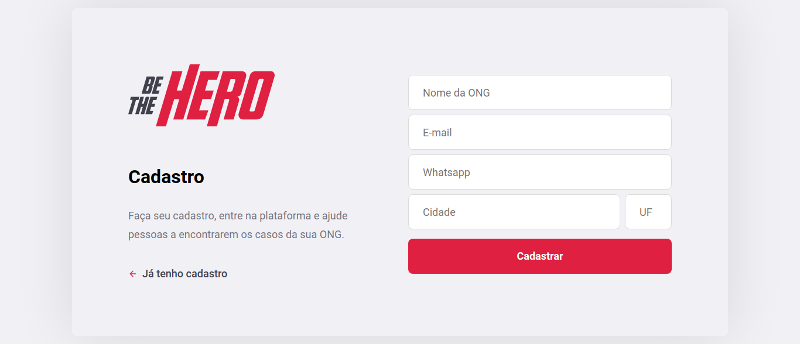
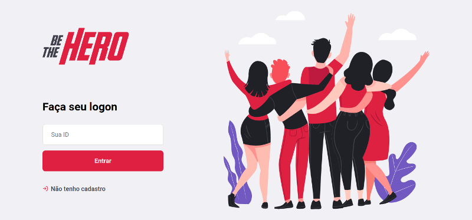
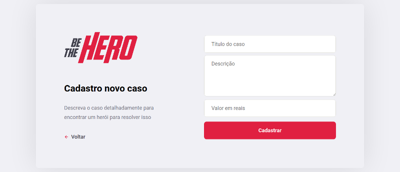
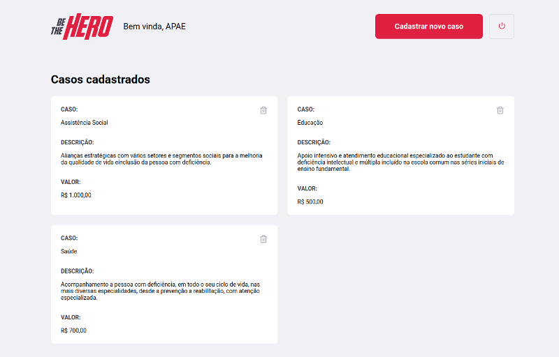
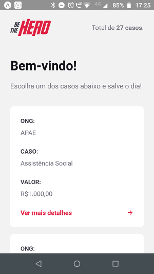
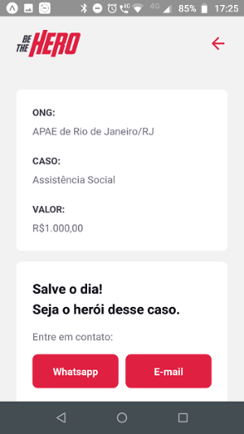

<h1 align="center">
  Semana OmniStack 11
</h1>
<h2 align="center">
    
</h2>

<p align="center">
  

  

  
</p>

## 💼 The Project
A project developed during the [OmniStack week](https://rocketseat.com.br). It consists of an application where ONGs and volunteers can meet and work together.

The project is divided in 3 parts: back-end, front-end and mobile.

### The back-end

This is where we have all the code to store the data. As this is a simple application developed during a week, it is a simple API with lots of room to improvement.

### The front-end

The front-end was developed using ReactJS and it's composed of ONG registration and incidents registrations. It's mainly an interface for the ONGs.

### Mobile app

The mobile app was developed using React Native and [expo](https://expo.io). It's the interface for people that want to help ONGs. Here we have incidents listing and ways to contact the ONGs.

## 📋 Probable Roadmap
- Host somewhere
- improve code quality and functionalities

## 🤓 Technologies

This project was developed using the following technologies:
- [Node.js](https://nodejs.org/en/)
- [React](https://reactjs.org)
- [React Native](https://facebook.github.io/react-native/)
- [Expo](https://expo.io/)

## 📷 Screenshots

[](web_1.png)

[](web_2.png)

[](web_3.png)

[](web_4.png)

[](mobile_1.png)

[](mobile_2.png)

## Developing Environment

As this is all local, all you have to do is start each application:

```
cd backend
yarn start
```

```
cd frontend
yarn start
```

```
cd mobile
yarn start
```